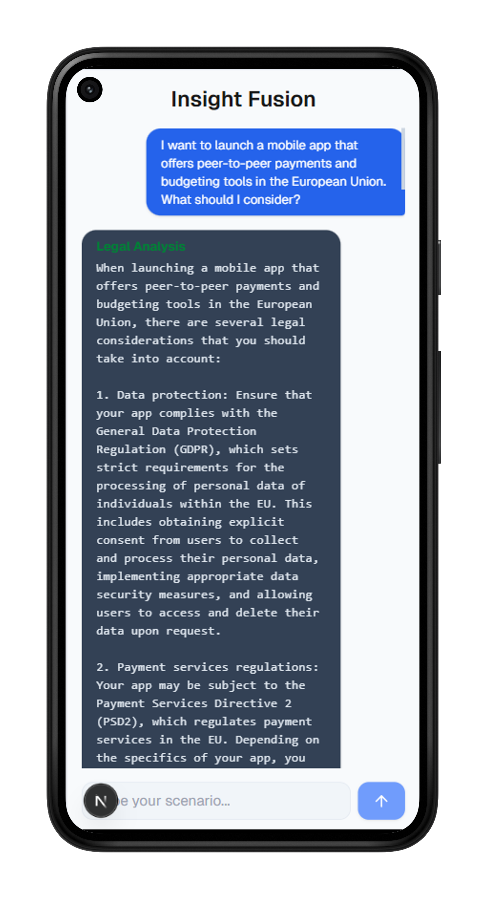

# Multi-Agent Streaming Chatbot Frontend

**Author:** Mohitkumar Mahto  
**Date:** Tuesday, May 13, 2025

---

## Overview

This is the **Next.js frontend** for the Multi-Agent Streaming Chatbot.  
It provides a modern, real-time chat interface that streams and displays responses from multiple AI agents (Legal, Finance, Marketing, Engineering) powered by a FastAPI backend.

---

## Features

- **Live streaming chat UI**: See agent responses appear in real time, just like ChatGPT.
- **Multi-agent formatting**: Each agent's analysis is clearly sectioned and styled.
- **API Route Proxy**: Securely proxies requests to the backend, supporting streaming.
- **Responsive Design**: Works across devices.
- **Easy Customization**: Built with modular React components and Tailwind CSS.

---

## Screenshots

<p align="center">
  
  
  
</p>
<p align="center">
  
  
</p>

---

## Project Structure

```
app/
  chat/
    page.tsx           # Main chatbot page
  api/
    chat/
      route.ts         # API route proxying to FastAPI backend
components/
  ChatBot.tsx          # Main chat logic and streaming handler
  ChatInput.tsx        # User input box
  ChatMessages.tsx     # Chat history with agent formatting
public/
  ss1.jpg
  ss2.jpg
  ss3.jpg
styles/
  globals.css
README.md
```

---

## Getting Started

### 1. Clone the repository

```
git clone https://github.com/your-username/multi-agent-chatbot-frontend.git
cd multi-agent-chatbot-frontend
```

### 2. Install dependencies

```
npm install
```

### 3. Configure Backend URL

By default, the frontend expects the backend at `http://localhost:8000`.  
If your backend runs elsewhere, update the URL in `/app/api/chat/route.ts`:

```
const backendResponse = await fetch('http://localhost:8000/analyze-stream', { ... })
```

### 4. Run the development server

```
npm run dev
```

Visit [http://localhost:3000/chat](http://localhost:3000/chat) to use the chatbot.

---

## How It Works

1. **User enters a scenario** in the chat input.
2. The frontend sends the scenario to `/api/chat` (a Next.js API route).
3. The API route proxies the request to the FastAPI backend and **streams the response**.
4. The UI displays each agent's analysis as it arrives, with clear formatting for each section.

---

## Customization

- **Styling:**  
  Uses Tailwind CSS. Edit `globals.css` or component classes to change the look.
- **Agent formatting:**  
  `ChatMessages.tsx` parses agent sections (e.g., `--- Legal Analysis ---`) and renders them with headings and pre-formatted text.
- **Add new agents:**  
  Update the backend and adjust frontend parsing if you add more agent types.

---


---

## Contact

**Mohitkumar Mahto**  
Email: mo2002hit@gmail.com  
GitHub: https://github.com/mohitkr07

---

## Acknowledgements

- [Next.js](https://nextjs.org/)
- [React](https://react.dev/)
- [Tailwind CSS](https://tailwindcss.com/)
- [FastAPI](https://fastapi.tiangolo.com/)
- [OpenAI](https://openai.com/)


